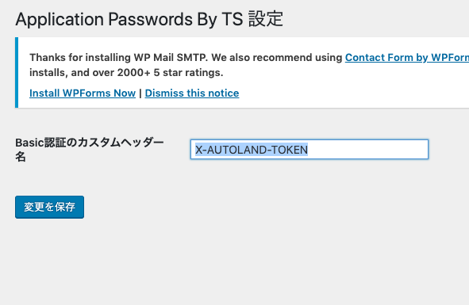

このプラグインは、REST APIの認証にカスタムヘッダーによる認証を可能にするプラグインです。
application password プラグインと同様に、ユーザーに紐づいたApplication Passwordを生成し、Basic認証を行います。
Authorization ヘッダーが使用できない時、このプラグインを使用してください。

## 設定方法

1. 設定 → Application Password By TS へ移動し、Basic認証のカスタムヘッダー名を入力してください。

2. ユーザー → いずれかのユーザーを選択し、Application Passwordsを生成してください。
その後、（ユーザー名:生成されたパスワード）の文字列をbase64エンコードしてください。

3. REST APIを使用する際、設定したカスタムヘッダーに対し（Basic base64エンコードした文字列）を指定することで認証ができます。
